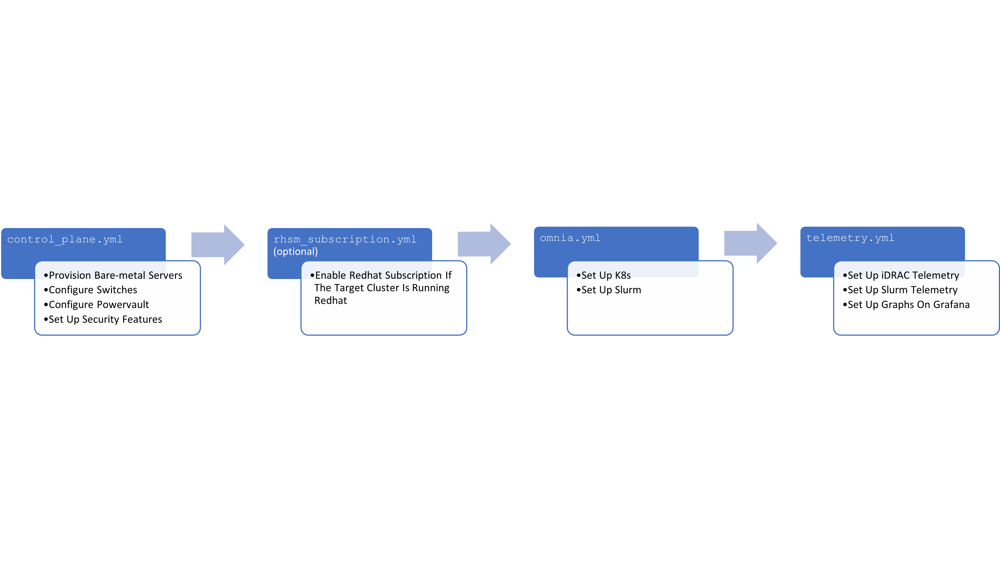

|Omnia version| |Downloads| |Last Commit| |Commits Since 1.4| |Contributors| |Forks| |License|

Ansible playbook-based deployment of Slurm and Kubernetes on servers running an RPM-based Linux OS
===================================================================================================

Omnia (Latin: all or everything) is a deployment tool to turn servers with RPM-based Linux images into functioning Slurm/Kubernetes clusters.

Pre Requisites before installing Omnia
++++++++++++++++++++++++++++++++++++++
- `Python3 <https://www.python.org/>`_
- `Ansible 2.12.7 <https://www.ansible.com/>`_
- `RockyOS <https://rockylinux.org/>`_ / `Red Hat <https://www.redhat.com/en/enterprise-linux-8>`_

Using Omnia
+++++++++++

1. Set up your network based on the sample topologies provided `here <docs/NETWORK_TOPOLOGY_LOM.md>`_
2. Verify that your system meets Omnia's `hardware <docs/Support_Matrix/Hardware>`_ and `software requirements <docs/Support_Matrix/Software/Operating_Systems>`_
3. Ensure that all `pre-requisites <docs/PreRequisites>`_ are met.
4. Fill out all the required `input parameters <docs/Input_Parameter_Guide>`_.
5. Run `Control_Plane <docs/Installation_Guides/INSTALL_CONTROL_PLANE.md>`_ to provision OS's, `configure devices <docs/Device_Configuration>`_ and `set up security measures <docs/Security>`_.
6. `Run Omnia on target cluster nodes <docs/Installation_Guides/INSTALL_OMNIA_CLI.md>`_ to set up Kubernetes and Slurm.
7. Run the `telemetry playbook to set up <docs/Installation_Guides/INSTALL_TELEMETRY.md>`_ and use `Telemetry and Visualization Services <docs/Telemetry_Visualization>`_.

.. note::
    For a complete guide to running Omnia via CLI, check `this <https://github.com/dellhpc/omnia/tree/devel/docs/CLI_GUIDE.md>`_ out!

Troubleshooting Omnia
+++++++++++++++++++++
* For a list of commonly encountered issues, check out our `FAQs <docs/source/Troubleshooting/FAQ.rst>`_.
* To troubleshoot Omnia, use our `Troubleshooting Guide <docs/Troubleshooting/source/Troubleshooting_Guide.rst>`_.

Omnia Community Members
++++++++++++++++++++++++

.. image:: https://download.logo.wine/logo/Dell_Technologies/Dell_Technologies-Logo.wine.png
   :width: 100pt

.. image:: https://i.pcmag.com/imagery/articles/05PmkAe4XLJQ94pQo36E1uc-1..v1599074802.jpg
    :width: 100pt

.. image:: https://www.shorttermprograms.com/images/cache/600_by_314/uploads/institution-logos/university-of-pisa.png
  :width: 100pt

.. image:: https://i.pinimg.com/originals/65/e3/37/65e33744f64c4d1f8f082785761b205a.png
  :width: 100pt

.. image:: https://www.vizias.com/uploads/1/1/8/9/118906653/published/thick-blue-white-ring-letters-full.png
    :width: 100pt

.. image:: https://user-images.githubusercontent.com/5414112/153955170-0a4b199a-54f0-42af-939c-03eac76881c0.png
  :width: 100pt

.. |Omnia version| image:: https://img.shields.io/github/v/release/dellhpc/omnia?include_prereleases
.. |Downloads| image:: https://img.shields.io/github/downloads/dellhpc/omnia/total
.. |Last Commit| image:: https://img.shields.io/github/last-commit/dellhpc/omnia/devel
.. |Commits Since 1.4| image:: https://img.shields.io/github/commits-since/dellhpc/omnia/v1.2.2/devel
.. |Contributors| image:: https://img.shields.io/github/all-contributors/dellhpc/omnia
   :target: docs/CONTRIBUTORS.md
   :alt: Contributors
.. |Forks| image:: https://img.shields.io/github/forks/dellhpc/omnia
.. |License| image:: https://img.shields.io/github/license/dellhpc/omnia
   :target: LICENSE
   :alt: Repository License
